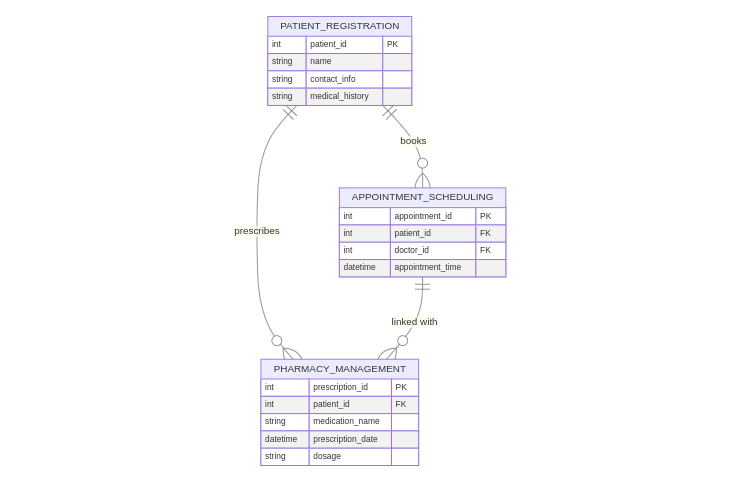

# Hospital-management

# Advanced Healthcare Management System

## Features

### 1. Jira Integration for Customer Support
- Seamlessly integrate Jira with the healthcare system to track and manage customer support tickets, provide resolution timelines, and ensure effective communication between patients and the support team.

### 2. Doctor Onboarding/Offboarding with Experience
- **Doctor Onboarding**:  
  - Record doctor details (specialization, qualifications, years of experience, certifications) and onboard them into the system with proper credential validation.  
  - Track ongoing training and continuous professional development (CPD) records.

- **Doctor Offboarding**:  
  - Manage offboarding procedures for retiring or terminated doctors, including record deactivation and the safe transfer of patient records.

### 3. Patient Onboarding and Health Data Updates
- **Patient Onboarding**:  
  - Collect basic information (name, age, gender, contact details) and medical history (allergies, previous illnesses, surgeries) upon first registration.
  
- **Health Data Updates**:  
  - Continuously update health records including treatments, medications, diagnoses, medical images (X-rays, MRIs), and lab reports.  
  - Integration with external healthcare providers for seamless data updates.

### 4. Appointment Scheduler
- **Doctor Calendar Integration**:  
  - Real-time integration with doctors' live calendars to reflect last-minute availability and avoid overbooking.
  
- **Dynamic Slot Notifications**:  
  - Automatically notify patients of earlier appointment slots if cancellations occur via SMS, email, or in-app push notifications.
  
- **Emergency Rescheduling**:  
  - Automatically reschedule appointments in case of emergencies, doctor delays, or unforeseen situations.

### 5. Machine Learning (ML) Powered Features

#### a) **Patient Modeling & Dashboards**
- Create dynamic patient dashboards for live tracking of health metrics such as blood pressure, heart rate, glucose levels, etc.  

#### b) **Predictive Health Risk Analysis**
- Use ML models to predict future health risks (e.g., diabetes, hypertension) based on historical patient data and recommend preventive measures.

#### c) **AI for Duplicate Record Removal**
- Leverage AI and data matching algorithms to automatically identify and merge duplicate patient records to maintain a clean database.

#### d) **Optimal Appointment Prediction**
- Predict and suggest optimal appointment times based on patient preferences, historical appointment data, and doctor availability.

#### e) **Prescription Error Detection (NLP)**
- Use Natural Language Processing (NLP) to analyze prescriptions for potential errors, drug interactions, and contraindications before medication is dispensed.

#### f) **Alternative Drug Suggestions**
- AI-powered suggestions for alternative drugs in cases of shortages, allergies, or contraindications, ensuring patient safety and optimal care.

#### g) **Prescription Trends Analysis**
- Generate actionable insights from prescription trends (e.g., most prescribed medications, seasonal trends) for inventory management and healthcare planning.

#### h) **Real-Time Hospital Efficiency Monitoring**
- Monitor hospital efficiency, patient flow, appointment trends, and patient satisfaction metrics in real time, adjusting resources dynamically.

#### i) **Resource Allocation Based on Patient Inflow**
- Predict hospital resource (doctors, rooms, equipment) requirements based on real-time patient inflow and usage data.

#### j) **Real-Time Chatbots for Patient Interaction**
- AI-powered real-time chatbots integrated into the system to handle patient inquiries, book appointments, provide medication guidance, and more.

### 6. Blockchain for EHR Reporting
- **Blockchain Integration**:  
  - Implement blockchain technology to store and manage Electronic Health Records (EHR) to ensure transparency, security, and data integrity.  
  - Provide tamper-proof, accessible health data sharing across different healthcare providers and systems.

### 7. Virtual Queue for Appointments
- **Virtual Queue Management**:  
  - Manage patient queues with real-time status updates.  
  - Allow patients to join virtual queues for doctor consultations, reducing in-person waiting times and improving patient flow.

### 8. Medication Dispensing and Tracking
- **Medication Tracking**:  
  - Generate dispensing records for each patient, ensuring medications are correctly dispensed as per prescribed instructions.
  - Track medications dispensed based on patient IDs, enabling accurate medication history tracking and preventing fraud.

## ER diagram :

